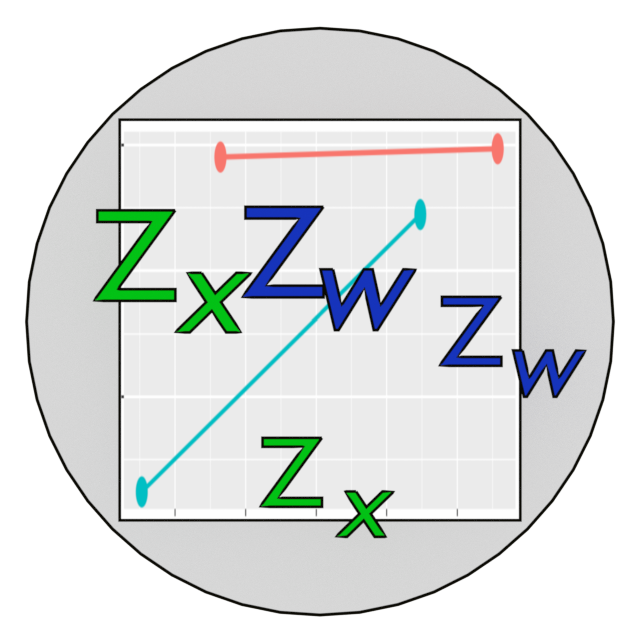

<!-- badges: start -->
[](https://lifecycle.r-lib.org/articles/stages.html#stable)
[](https://www.repostatus.org/#active)
[](https://CRAN.R-project.org/package=stdmod)
[](https://cran.r-project.org/package=stdmod)
[](https://r-pkg.org/pkg/stdmod)
[](https://github.com/sfcheung/stdmod)
[](https://github.com/sfcheung/stdmod/commits/master)
[](https://github.com/sfcheung/stdmod/actions/workflows/R-CMD-check.yaml)
[](https://doi.org/10.1037/hea0001188)
<!-- badges: end -->


# stdmod: Standardized Moderation 

(Version 0.2.10.2, updated on 2024-05-11, [release history](https://sfcheung.github.io/stdmod/news/index.html))

(Important changes since 0.2.0.0: Bootstrap confidence intervals and
variance-covariance matrix of estimates are the defaults of `confint()`
and `vcov()` for the output of `std_selected_boot()`.)

This package includes functions for computing a standardized
moderation effect and forming its confidence interval by
nonparametric bootstrapping correctly. It was described briefly
in the following publication ([OSF project page](https://osf.io/ac8de/)).
It supports moderated regression conducted by `stats::lm()` and path
analysis with product term conducted by `lavaan::lavaan()`.

- Cheung, S. F., Cheung, S.-H., Lau, E. Y. Y., Hui, C. H., & Vong, W. N. (2022) Improving an old way to measure moderation effect in standardized units. *Health Psychology, 41*(7), 502-505. https://doi.org/10.1037/hea0001188.

More information on this package:

https://sfcheung.github.io/stdmod/

## Quick Links:

- [stdmod](https://sfcheung.github.io/stdmod/articles/stdmod.html): A quick start on how to use
  `std_selected()` and `std_selected_boot()`, the
  two main functions, to standardize selected variables
  in a regression model and refit the model.

- [moderation](https://sfcheung.github.io/stdmod/articles/moderation.html): How
  to use `std_selected()` and `std_selected_boot()` to compute standardized
  moderation effect and form its nonparametric bootstrap confidence interval.

- [std_selected](https://sfcheung.github.io/stdmod/articles/std_selected.html): How to use
  `std_selected()` to mean center or standardize selected
  variables in any regression models, and use
  `std_selected_boot()` to form nonparametric
  bootstrap confidence intervals
  for standardized regression coefficients (*betas* in
  psychology literature).

- [plotmod](https://sfcheung.github.io/stdmod/articles/plotmod.html): How to generate a typical plot of
  moderation effect using `plotmod()`.

- [cond_effect](https://sfcheung.github.io/stdmod/articles/cond_effect.html): How to compute conditional
  effects of the predictor for selected
  levels of the moderator, and form nonparametric bootstrap
  confidence intervals these effects.

# Installation

The stable CRAN version can be installed by `install.packages()`:

```
install.packages("stdmod")
```

The latest version of this package at GitHub can be
installed by `remotes::install_github()`:

```
remotes::install_github("sfcheung/stdmod")
```

# Implementation

The main function, `std_selected()`, accepts an `lm()`
output, standardizes variables by users, and update the
results. If interaction terms are present, they will be
formed after the standardization. If bootstrap
confidence intervals are requested using
`std_selected_boot()`, both standardization
and regression will be repeated in each bootstrap sample,
ensuring that the sampling variability of the standardizers
(e.g., the standard deviations of the selected variables),
are also taken into account.

# Issues

If you have any suggestions and found any bugs, please feel
feel to open a GitHub issue. Thanks.
