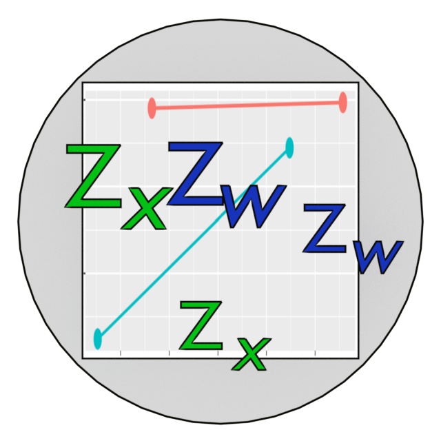

<!-- badges: start -->
[](https://lifecycle.r-lib.org/articles/stages.html#stable)
[](https://www.repostatus.org/#active)
[](https://CRAN.R-project.org/package=stdmod)
[](https://cran.r-project.org/package=stdmod)
[](https://r-pkg.org/pkg/stdmod)
[](https://github.com/sfcheung/stdmod)
[](https://github.com/sfcheung/stdmod/commits/master)
[](https://github.com/sfcheung/stdmod/actions/workflows/R-CMD-check.yaml)
[](https://doi.org/10.1037/hea0001188)
<!-- badges: end -->


# stdmod: Standardized Moderation 

(Version 0.2.13, updated on 2026-05-04, [release history](https://sfcheung.github.io/stdmod/news/index.html))

**IMPORTANT NOTICE**

> This package will no longer be actively updated. It will
still be maintained. However, new features will not be added.
The package [`manymome`](https://sfcheung.github.io/manymome/)
can do all the tasks in `stdmod` related to computing,
testing, and printing conditional effects, and can be used
for any number of moderators. The package
[`betaselectr`](https://sfcheung.github.io/betaselectr/)
can do all the tasks related to forming confidence intervals
for properly standardized coefficients, in both regression
models fitted by `stats::lm()` and `stats::glm()`, as well
as structural equation models fitted by `lavaan::sem()`.

> For standardizing only selected variables and for properly
standardizing product terms in regression models fitted by
`stats::lm()`, the function [`lm_betaselect()`](https://sfcheung.github.io/betaselectr/articles/betaselectr_lm.html)
from [`betaselectr`](https://sfcheung.github.io/betaselectr/)
can be used instead of `std_selected()` and `std_selected_boot()`.
The package also has supports models fitted by `stats::glm()`,
such as logistic regression models. See [this article](https://sfcheung.github.io/betaselectr/articles/betaselectr_glm.html)
for a demonstration.

> For standardizing only selected variables in models fitted
by `lavaan`, `lavaan` natively supports this since version 0.7-2,
through setting `type` to a character vector of the variables
to be standardized. Alternatively, the function [`lav_betaselect()`](https://sfcheung.github.io/betaselectr/articles/betaselectr_lav.html)
from [`betaselectr`](https://sfcheung.github.io/betaselectr/)
can also be used. [`lav_betaselect()`](https://sfcheung.github.io/betaselectr/reference/lav_betaselect.html)
also supports properly standardizing a product term. In addition
to bootstrap confidence intervals, [`lav_betaselect()`](https://sfcheung.github.io/betaselectr/reference/lav_betaselect.html)
also supports delta-method confidence intervals.

> For computing conditional effects and plotting conditional
effects in regression models, the package [`manymome`](https://sfcheung.github.io/manymome/)
has more comprehensive support. See [these articles](https://sfcheung.github.io/manymome/articles/#moderated-regression)
for some demonstration. The package also supports moderation
in structural equation models fitted by `lavaan`.

(Important changes since 0.2.0.0: Bootstrap confidence intervals and
variance-covariance matrix of estimates are the defaults of `confint()`
and `vcov()` for the output of `std_selected_boot()`.)

This package includes functions for computing a standardized
moderation effect and forming its confidence interval by
nonparametric bootstrapping correctly. It was described briefly
in the following publication ([OSF project page](https://osf.io/ac8de/)).
It supports moderated regression conducted by `stats::lm()` and path
analysis with product term conducted by `lavaan::lavaan()`.

- Cheung, S. F., Cheung, S.-H., Lau, E. Y. Y., Hui, C. H., & Vong, W. N. (2022) Improving an old way to measure moderation effect in standardized units. *Health Psychology, 41*(7), 502-505. https://doi.org/10.1037/hea0001188.

More information on this package:

https://sfcheung.github.io/stdmod/

## Quick Links:

- [stdmod](https://sfcheung.github.io/stdmod/articles/stdmod.html): A quick start on how to use
  `std_selected()` and `std_selected_boot()`, the
  two main functions, to standardize selected variables
  in a regression model and refit the model.

- [moderation](https://sfcheung.github.io/stdmod/articles/moderation.html): How
  to use `std_selected()` and `std_selected_boot()` to compute standardized
  moderation effect and form its nonparametric bootstrap confidence interval.

- [std_selected](https://sfcheung.github.io/stdmod/articles/std_selected.html): How to use
  `std_selected()` to mean center or standardize selected
  variables in any regression models, and use
  `std_selected_boot()` to form nonparametric
  bootstrap confidence intervals
  for standardized regression coefficients (*betas* in
  psychology literature).

- [plotmod](https://sfcheung.github.io/stdmod/articles/plotmod.html): How to generate a typical plot of
  moderation effect using `plotmod()`.

    - It is recommended to use [`manymome`](https://sfcheung.github.io/manymome/)
      for plotting conditional effects. See [this article](https://sfcheung.github.io/manymome/articles/mo_lm.html)
      for a demonstration, and [these articles](https://sfcheung.github.io/manymome/articles/#moderated-regression)
      for more complicated models.

- [cond_effect](https://sfcheung.github.io/stdmod/articles/cond_effect.html): How to compute conditional
  effects of the predictor for selected
  levels of the moderator, and form nonparametric bootstrap
  confidence intervals these effects.

    - It is recommended to use [`manymome`](https://sfcheung.github.io/manymome/)
      for computing conditional effects. See [this article](https://sfcheung.github.io/manymome/articles/mo_lm.html)
      for a demonstration, and [these articles](https://sfcheung.github.io/manymome/articles/#moderated-regression)
      for more complicated models.

## Related Functions in `betaselectr`

The function `lm_betaselect()` from the package `betaselectr`
can be used in place
of `std_selected()` and `std_selected_boot()`. A demonstration
of `lm_betaselect()` can be found [here](https://sfcheung.github.io/betaselectr/articles/betaselectr_lm.html).
This package also has `glm_betaselect()` for models, such
as logistic regression models, fitted by `stats::glm()`
(see a demonstration [here](https://sfcheung.github.io/betaselectr/articles/betaselectr_glm.html)).

The function `lav_betaselect()` from the package `betaselectr`
is a version of `std_selected()` but for structural equation
models fitted by `lavaan::sem()`. A demonstration
of `lav_betaselect()` can be found [here](https://sfcheung.github.io/betaselectr/articles/betaselectr_lav.html).

## Related Functions in `manymome`

Although the package `manymome` is mainly for mediation and
moderated mediation, moderation is a special case and is also
supported. The `plot` method in `manymome` is more powerful
than `plotmod`, supports not only a regression model but also
a structural equation model, and also supports any number of
moderators. The function `manymome::cond_effects()` in `manymome`
is also more powerful than `cond_effect` in `stdmod`, supporting
both regression models and structural equation models.

# Installation

The stable CRAN version can be installed by `install.packages()`:

```
install.packages("stdmod")
```

The latest version of this package at GitHub can be
installed by `remotes::install_github()`:

```
remotes::install_github("sfcheung/stdmod")
```

# Implementation

The main function, `std_selected()`, accepts an `lm()`
output, standardizes variables by users, and update the
results. If interaction terms are present, they will be
formed after the standardization. If bootstrap
confidence intervals are requested using
`std_selected_boot()`, both standardization
and regression will be repeated in each bootstrap sample,
ensuring that the sampling variability of the standardizers
(e.g., the standard deviations of the selected variables),
are also taken into account.

# Issues

If you have any suggestions and found any bugs, please feel
free to open a GitHub issue. Thanks.
