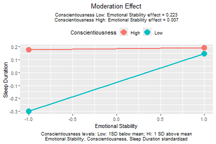

# Purpose

This document demonstrates how to use `std_selected()` from
the `stdmod` package to compute the correct
standardized solution of moderated regression.
More about this package can be found
in `vignette("stdmod", package = "stdmod")`
or at [https://sfcheung.github.io/stdmod/](https://sfcheung.github.io/stdmod/).

# Setup the Environment


``` r
library(stdmod) # For computing the standardized moderation effect conveniently
```

# Load the Dataset


``` r
data(sleep_emo_con)
head(sleep_emo_con, 3)
#> # A tibble: 3 × 6
#>   case_id sleep_duration conscientiousness emotional_stability   age gender
#>     <int>          <dbl>             <dbl>               <dbl> <dbl> <chr> 
#> 1       1              6               3.6                 3.6    20 female
#> 2       2              4               3.8                 2.4    20 female
#> 3       3              7               4.3                 2.7    20 female
```

This data set has 500 cases of data. The variables are sleep duration, age, gender,
and the scores from two personality scales, emotional stability and
conscientiousness of the IPIP Big Five markers. Please refer to
(citation to be added) for the detail of the data set.

The names of some variables are shortened for readability:


``` r
colnames(sleep_emo_con)[3:4] <- c("cons", "emot")
head(sleep_emo_con, 3)
#> # A tibble: 3 × 6
#>   case_id sleep_duration  cons  emot   age gender
#>     <int>          <dbl> <dbl> <dbl> <dbl> <chr> 
#> 1       1              6   3.6   3.6    20 female
#> 2       2              4   3.8   2.4    20 female
#> 3       3              7   4.3   2.7    20 female
```


# Moderated Regression

Suppose we are interested in predicting sleep duration by emotional stability,
after controlling for gender and age. However, we suspect that the effect of
emotional stability, if any, may be moderated by conscientiousness. Therefore,
we conduct a moderated regression as follow:


``` r
lm_out <- lm(sleep_duration ~ age + gender + emot * cons,
             data = sleep_emo_con)
summary(lm_out)
#> 
#> Call:
#> lm(formula = sleep_duration ~ age + gender + emot * cons, data = sleep_emo_con)
#> 
#> Residuals:
#>     Min      1Q  Median      3Q     Max 
#> -6.0841 -0.7882  0.0089  0.9440  6.1189 
#> 
#> Coefficients:
#>             Estimate Std. Error t value Pr(>|t|)   
#> (Intercept)  1.85154    1.35224   1.369  0.17155   
#> age          0.01789    0.02133   0.838  0.40221   
#> gendermale  -0.26127    0.16579  -1.576  0.11570   
#> emot         1.32151    0.45039   2.934  0.00350 **
#> cons         1.20385    0.37062   3.248  0.00124 **
#> emot:cons   -0.33140    0.13273  -2.497  0.01286 * 
#> ---
#> Signif. codes:  0 '***' 0.001 '**' 0.01 '*' 0.05 '.' 0.1 ' ' 1
#> 
#> Residual standard error: 1.384 on 494 degrees of freedom
#> Multiple R-squared:  0.0548,	Adjusted R-squared:  0.04523 
#> F-statistic: 5.728 on 5 and 494 DF,  p-value: 3.768e-05
plotmod(lm_out,
        x = "emot",
        w = "cons",
        x_label = "Emotional Stability",
        w_label = "Conscientiousness",
        y_label = "Sleep Duration")
```

<div class="figure" style="text-align: center">

<p class="caption">plot of chunk mod_reg</p>
</div>

The results show that conscientiousness significantly moderates the effect of
emotional stability on sleep duration.

# Standardized Moderation Effect

To get the correct standardized solution of the moderated regression, with the
product term formed *after* standardization, we can use `std_selected()`.

- The first argument is the regression output from `lm()`.

- The argument `to_center` specifies variables to be mean
  centered.

- The argument `to_scale` specifies variables to be rescaled
  by their standard deviations after centering.

- In `stdmod` 0.2.6.3, the argument `to_standardize` was introduced
  as a shortcut. Listing a variable in `to_standardize` is
  equivalent to listing it in `to_center` and `to_scale`.

If we want to standardize or mean center all variables, we can use `~ .` as a
shortcut. Note that `std_selected()` will  automatically skip categorical
variables (i.e., factors or string variables in the regression model of `lm()`).


``` r
lm_stdall <- std_selected(lm_out,
                          to_standardize = ~ .)
```

Before 0.2.6.3, to standardize all variables except for
categorical variables, we need to use both `to_center = ~ .`
and `to_scale = ~ .`. Since 0.2.6.3,
we can just use `to_standardize = ~ .`, as shown above.
If `to_standardize = ~ .` does not work, just use
`to_center` and `to_scale` as shown below:

```r
lm_stdall <- std_selected(lm_out,
                          to_center = ~ .,
                          to_scale = ~ .)
```

A summary of the results of `std_selected()` can be
generated by `summary()`:


``` r
summary(lm_stdall)
#> 
#> Call to std_selected():
#> std_selected(lm_out = lm_out, to_standardize = ~.)
#> 
#> Selected variable(s) are centered by mean and/or scaled by SD
#> - Variable(s) centered: sleep_duration age gender emot cons
#> - Variable(s) scaled: sleep_duration age gender emot cons
#> 
#>                centered_by scaled_by                            Note
#> sleep_duration    6.776333 1.4168291 Standardized (mean = 0, SD = 1)
#> age              22.274000 2.9407857 Standardized (mean = 0, SD = 1)
#> gender                  NA        NA Nonnumeric                     
#> emot              2.713200 0.7629613 Standardized (mean = 0, SD = 1)
#> cons              3.343200 0.6068198 Standardized (mean = 0, SD = 1)
#> 
#> Note:
#> - Categorical variables will not be centered or scaled even if
#>   requested.
#> 
#> Call:
#> lm(formula = sleep_duration ~ age + gender + emot * cons, data = dat_mod)
#> 
#> Residuals:
#>     Min      1Q  Median      3Q     Max 
#> -4.2941 -0.5563  0.0063  0.6663  4.3187 
#> 
#> Coefficients:
#>             Estimate Std. Error t value Pr(>|t|)   
#> (Intercept)   0.0549     0.0488  1.1248  0.26124   
#> age           0.0371     0.0443  0.8384  0.40221   
#> gendermale   -0.1844     0.1170 -1.5759  0.11570   
#> emot          0.1150     0.0449  2.5600  0.01076 * 
#> cons          0.1305     0.0452  2.8893  0.00403 **
#> emot:cons    -0.1083     0.0434 -2.4967  0.01286 * 
#> ---
#> Signif. codes:  0 '***' 0.001 '**' 0.01 '*' 0.05 '.' 0.1 ' ' 1
#> 
#> Residual standard error: 0.9771 on 494 degrees of freedom
#> 
#> R-squared                : 0.0548
#> Adjusted R-squared       : 0.0452
#> ANOVA test of R-squared  : F(5, 494) = 5.7277, p < 0.001
#> 
#> = Test the highest order term =
#> The highest order term             : emot:cons
#> R-squared increase adding this term: 0.0119
#> F test of R-squared increase       : F(1, 494) = 6.2335, p = 0.013
#> 
#> Note:
#> - Estimates and their statistics are based on the data after
#>   mean-centering, scaling, or standardization.
#> - One or more variables are scaled by SD or standardized. OLS standard
#>   errors and confidence intervals may be biased for their coefficients.
#>   Please use `std_selected_boot()`.
```

The coefficient in this solution,
-0.10829,
can be interpreted as the change in the standardized effect of
emotional stability for each one standard deviation increase of
conscientiousness. Naturally, this can be called the
*standardized moderation effect* of conscientiousness
([Cheung, Cheung, Lau, Hui, & Vong, 2022](https://doi.org/10.1037/hea0001188)).

The output of `std_selected()` can be passed to other functions that accept the
output of `lm()`. This package also has a simple function,
`plotmod()`, for generating a typical plot of the moderation effect:


``` r
plotmod(lm_stdall,
        x = "emot",
        w = "cons",
        x_label = "Emotional Stability",
        w_label = "Conscientiousness",
        y_label = "Sleep Duration")
```

<div class="figure" style="text-align: center">

<p class="caption">plot of chunk mod_reg_stdall</p>
</div>

The function `plotmod()` also prints the conditional effects of the predictor
(focal variable), emotional stability in this example.

# The Common (Incorrect) Standardized Solution

For comparison, this is the results of standardizing all variables, including
the product term and the categorical variable.


``` r
library(lm.beta) # For generating the typical standardized solution
packageVersion("lm.beta")
#> [1] '1.7.3'
lm_beta <- lm.beta(lm_out)
summary(lm_beta)
#> 
#> Call:
#> lm(formula = sleep_duration ~ age + gender + emot * cons, data = sleep_emo_con)
#> 
#> Residuals:
#>     Min      1Q  Median      3Q     Max 
#> -6.0841 -0.7882  0.0089  0.9440  6.1189 
#> 
#> Coefficients:
#>             Estimate Standardized Std. Error t value Pr(>|t|)   
#> (Intercept)  1.85154           NA    1.35224   1.369  0.17155   
#> age          0.01789      0.03712    0.02133   0.838  0.40221   
#> gendermale  -0.26127     -0.06934    0.16579  -1.576  0.11570   
#> emot         1.32151      0.71163    0.45039   2.934  0.00350 **
#> cons         1.20385      0.51560    0.37062   3.248  0.00124 **
#> emot:cons   -0.33140     -0.78201    0.13273  -2.497  0.01286 * 
#> ---
#> Signif. codes:  0 '***' 0.001 '**' 0.01 '*' 0.05 '.' 0.1 ' ' 1
#> 
#> Residual standard error: 1.384 on 494 degrees of freedom
#> Multiple R-squared:  0.0548,	Adjusted R-squared:  0.04523 
#> F-statistic: 5.728 on 5 and 494 DF,  p-value: 3.768e-05
```

The coefficient of the *standardized* product term is
-0.78201, which
*cannot* be interpreted as the change in the standardized effect of
emotional stability for each one standard deviation increase of
conscientiousness because the product term is standardized and can no longer
be interpreted as the product of two variables in the model.

# Improved Confidence Intervals

It has been shown (e.g., [Yuan & Chan, 2011](https://doi.org/10.1007/s11336-011-9224-6))
that the standard errors of
standardized regression coefficients computed just by standardizing the variables
are biased, and consequently the confidence intervals are also invalid. The
function `std_selected_boot()` is a wrapper of `std_selected()` that also
forms the confidence interval of the regression coefficients when standardizing
is conducted, using nonparametric bootstrapping as suggested by
Cheung, Cheung, Lau, Hui, and Vong (2022).

We use the same example above that standardizes all variables except for
categorical variables to illustrate this function. The argument `nboot`
specifies the number of nonparametric bootstrap samples.
The level of confidence is set by `conf`. The default is .95, denoting 95%
confidence intervals. If this is the desired level, this argument can be
omitted.


```r
set.seed(649017)
lm_xwy_std_ci <- std_selected_boot(lm_out,
                                   to_standardize = ~ .,
                                   nboot = 2000)
```

If the default options are acceptable, the only additional argument is `nboot`.


``` r
summary(lm_xwy_std_ci)
#> 
#> Call to std_selected_boot():
#> std_selected_boot(lm_out = lm_out, to_scale = ~., to_center = ~., 
#>     nboot = 2000)
#> 
#> Selected variable(s) are centered by mean and/or scaled by SD
#> - Variable(s) centered: sleep_duration age gender emot cons
#> - Variable(s) scaled: sleep_duration age gender emot cons
#> 
#>                centered_by scaled_by                            Note
#> sleep_duration    6.776333 1.4168291 Standardized (mean = 0, SD = 1)
#> age              22.274000 2.9407857 Standardized (mean = 0, SD = 1)
#> gender                  NA        NA Nonnumeric                     
#> emot              2.713200 0.7629613 Standardized (mean = 0, SD = 1)
#> cons              3.343200 0.6068198 Standardized (mean = 0, SD = 1)
#> 
#> Note:
#> - Categorical variables will not be centered or scaled even if
#>   requested.
#> - Nonparametric bootstrapping 95% confidence intervals computed.
#> - The number of bootstrap samples is 2000.
#> 
#> Call:
#> lm(formula = sleep_duration ~ age + gender + emot * cons, data = dat_mod)
#> 
#> Residuals:
#>     Min      1Q  Median      3Q     Max 
#> -4.2941 -0.5563  0.0063  0.6663  4.3187 
#> 
#> Coefficients:
#>             Estimate CI Lower CI Upper Std. Error t value Pr(>|t|)   
#> (Intercept)   0.0549   0.0030   0.1043     0.0488  1.1248  0.26124   
#> age           0.0371  -0.0363   0.1036     0.0443  0.8384  0.40221   
#> gendermale   -0.1844  -0.4389   0.0876     0.1170 -1.5759  0.11570   
#> emot          0.1150   0.0236   0.2024     0.0449  2.5600  0.01076 * 
#> cons          0.1305   0.0324   0.2242     0.0452  2.8893  0.00403 **
#> emot:cons    -0.1083  -0.2040  -0.0097     0.0434 -2.4967  0.01286 * 
#> ---
#> Signif. codes:  0 '***' 0.001 '**' 0.01 '*' 0.05 '.' 0.1 ' ' 1
#> 
#> Residual standard error: 0.9771 on 494 degrees of freedom
#> 
#> R-squared                : 0.0548
#> Adjusted R-squared       : 0.0452
#> ANOVA test of R-squared  : F(5, 494) = 5.7277, p < 0.001
#> 
#> = Test the highest order term =
#> The highest order term             : emot:cons
#> R-squared increase adding this term: 0.0119
#> F test of R-squared increase       : F(1, 494) = 6.2335, p = 0.013
#> 
#> Note:
#> - Estimates and their statistics are based on the data after
#>   mean-centering, scaling, or standardization.
#> - [CI Lower, CI Upper] are bootstrap percentile confidence intervals.
#> - Std. Error are not bootstrap SEs.
```


The standardized moderation effect is
-0.1083,
and the 95% nonparametric bootstrap confidence interval is
-0.2040 to
-0.0097.

Note: As a side product, the nonparametric bootstrap percentile confidence of the other
coefficients are also reported. They can be used for other variables that are
standardized in the same model, whether they are involved in the moderation or not.

# Further Information

`vignette("plotmod", package = "stdmod")` illustrates how to use `plotmod()` to plot a moderation
effect. If variables are standardized by `std_selected()`, `plotmod()` can
indicate this in the plot.

`vignette("cond_effect", package = "stdmod")` illustrates how to use `cond_effect()` to compute
conditional effects, the effect of a predictor (focal variable) for selected
levels of the moderator.
`cond_effect()` supports outputs from `std_selected()`.

# Reference(s)

Cheung, S. F., Cheung, S.-H., Lau, E. Y. Y., Hui, C. H., & Vong, W. N. (2022)
Improving an old way to measure moderation effect in standardized units.
*Health Psychology*, *41*(7), 502-505. https://doi.org/10.1037/hea0001188.

Yuan, K.-H., & Chan, W. (2011). Biases and standard errors of standardized
regression coefficients. *Psychometrika, 76*(4), 670-690.
https://doi.org/10.1007/s11336-011-9224-6
